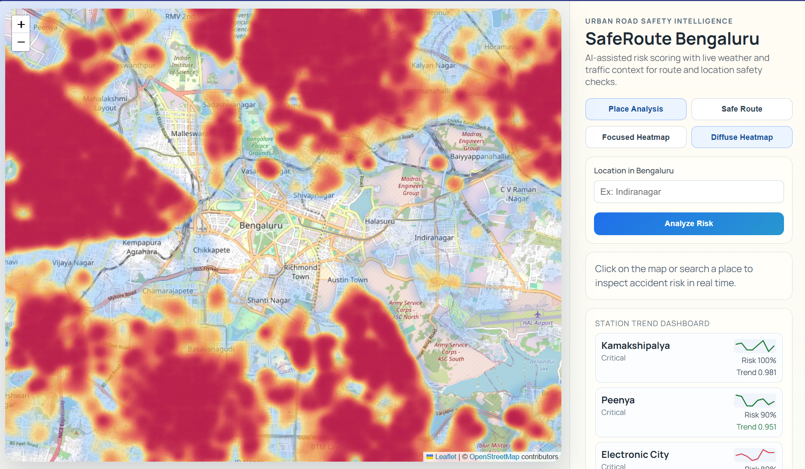
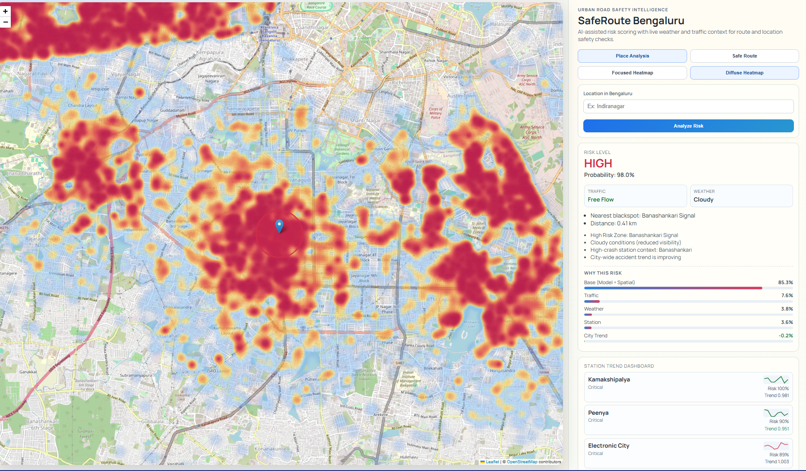
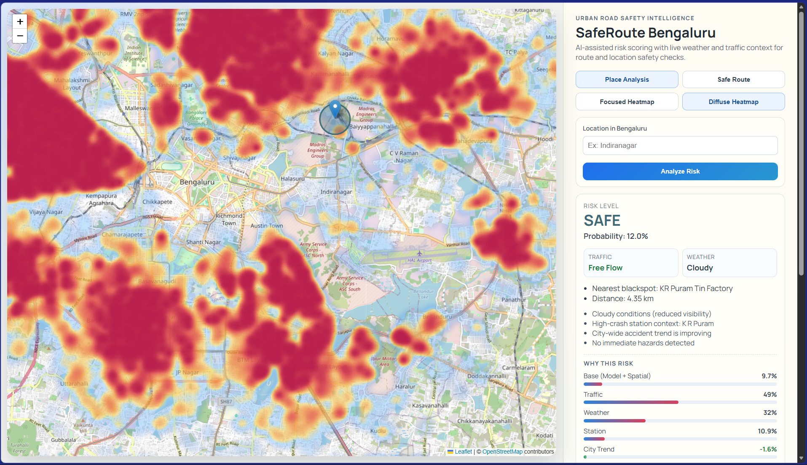
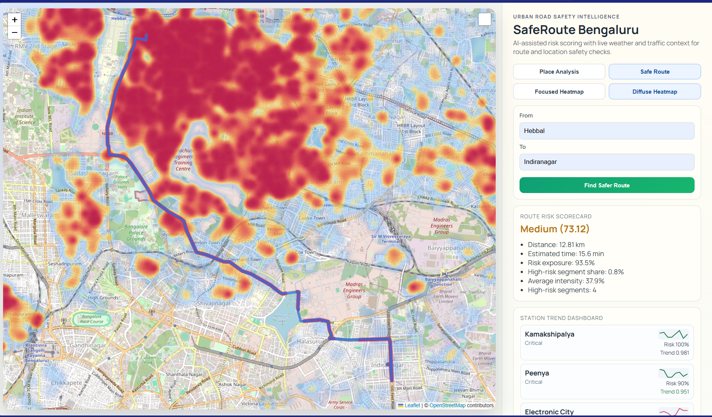

# SafeRoute Bengaluru


SafeRoute Bengaluru is an AI-powered urban road safety intelligence platform that predicts accident risk using:
- Spatial risk around known blackspots
- A trained XGBoost model
- Live traffic and weather context

It provides an interactive geospatial interface to analyze location-level safety and compare safer route options across Bengaluru.

## Project Highlights

- Real-world problem focus with city-scale road safety use case
- Hybrid risk engine that combines ML inference with interpretable spatial logic
- End-to-end full stack: data pipeline, model training, FastAPI backend, React + Leaflet frontend
- Actionable UX with heatmaps, place-level diagnostics, and route risk scorecards

## Product Preview

### 1) Bengaluru Accident Heatmap
City-wide risk intensity visualization for hotspot discovery.



### 2) Particular Place Analysis
Detailed risk breakdown for a selected location with contributing factors.



### 3) Another Place Analysis
Comparative place analysis view for additional risk inspection.



### 4) Safe Route Between Two Places
Route-level risk scorecard to support safer navigation decisions.



## Architecture

- `backend/src/`: Dataset creation, feature engineering, model training
- `backend/api/`: FastAPI inference and analytics APIs
- `backend/data/`: Raw/processed datasets and model artifacts
- `frontend/`: React + Leaflet client for map-based risk exploration

Workflow:
1. Build a training dataset using OSM intersections and blackspot proximity features.
2. Train XGBoost on engineered accident-risk labels.
3. Serve inference and map endpoints through FastAPI (`/predict`, `/heatmap`, `/health`).
4. Visualize risk zones and safer routes in the frontend.

## API Endpoints

- `GET /health` - Service health and available heatmap point count
- `GET /predict?lat=<float>&lon=<float>` - Risk score, severity, and contextual factors
- `GET /heatmap` - High-risk points for map rendering

## Local Setup

### 1. Backend

```bash
cd backend
pip install -r requirements.txt
copy .env.example .env
python -m uvicorn api.main:app --reload
```

### 2. Frontend

```bash
cd frontend
npm install
copy .env.example .env
npm run dev
```

Frontend runs on `http://localhost:5173` and connects to the backend via `VITE_API_BASE_URL`.

## Model Pipeline

```bash
cd backend
python -m src.build_dataset
python -m src.train_model
```

## Engineering Notes

- API-level coordinate validation is enforced for reliability.
- Live traffic/weather integrations include fallback behavior.
- Configuration is environment-driven for local and deployment flexibility.

## Roadmap

- Add model performance dashboard (ROC, precision-recall, drift monitoring)
- Introduce temporal features (weekday/hour traffic dynamics)
- Add Dockerization and CI for one-command deployment
